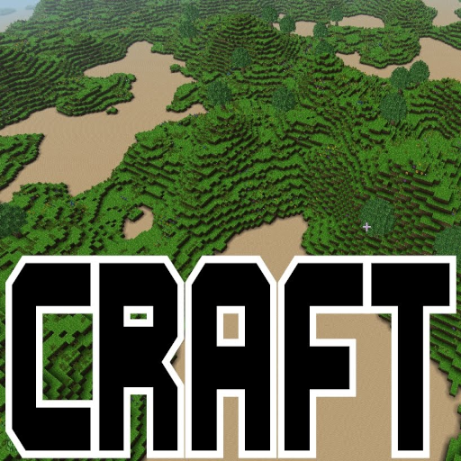
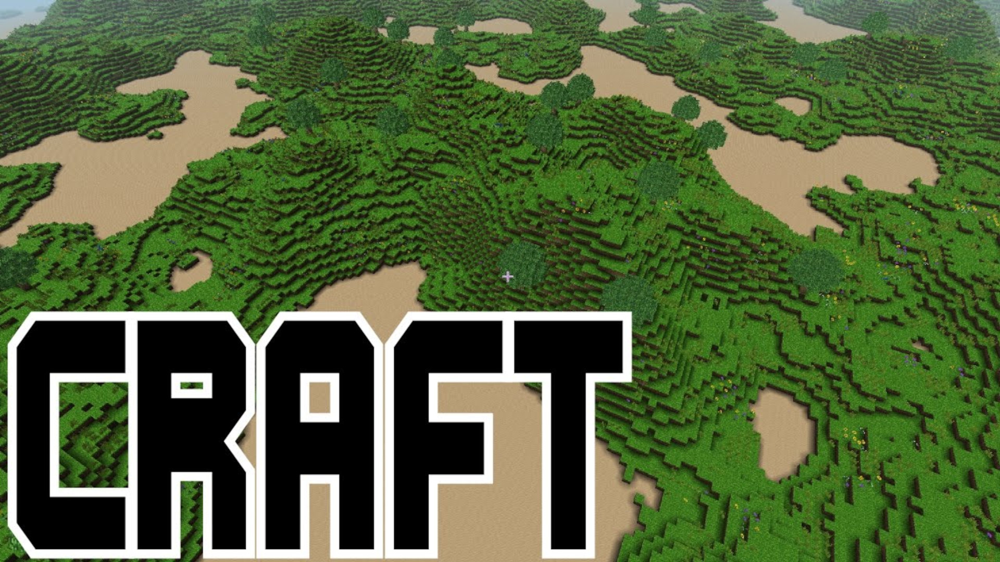

# Minecraft (Craft)

### Description

Craft is a simple Minecraft clone written in C using modern OpenGL.

### License

MIT

### Icon

### Fanart

### Screenshots

Help make me screenshots!

### Disclaimer

*Image credit: Aaron Smith*
